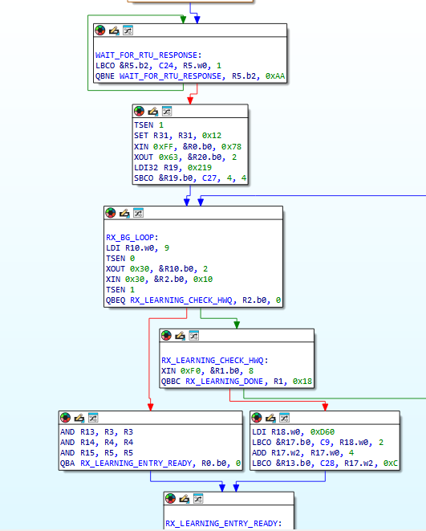
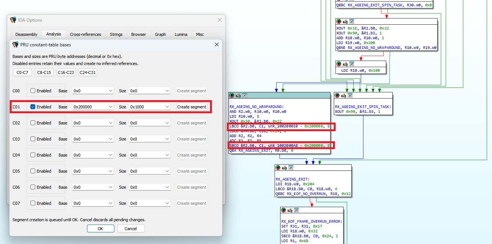
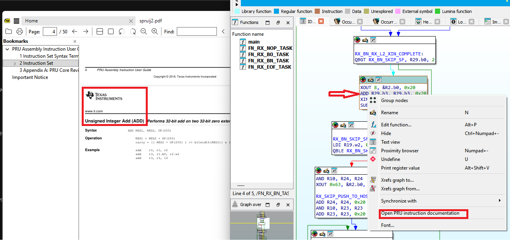

# PRU IDA Support Package

Native Texas Instruments PRU analysis for IDA Pro 8.4 (`ida64.exe`) on Windows.

The `pru64.dll` processor module decodes PRU firmware into instructions, registers,
and operands, with analysis of branches, calls, returns, and supported memory
references. The included plugin provides PRU ELF recognition and instruction help.

## Supported processors

| Processor | IDA short name |
| --- | --- |
| Texas Instruments PRU V0 | `pru0` |
| Texas Instruments PRU V1 | `pru1` |
| Texas Instruments PRU V2 | `pru2` |
| Texas Instruments PRU V3 | `pru` |
| Texas Instruments PRU V4 | `pru4` |

For a new PRU ELF, TI build attributes select the processor version automatically.
Files without version metadata default to V3. For raw binaries, select the version
manually and supply the appropriate loading address.

## What you get

- Instruction disassembly with typed registers, subregisters, bit operands, and immediates
- Control-flow analysis for branches, calls, and standard ABI returns
- Separate code and data address spaces, including overlapping logical addresses
- Data references for supported loads and stores
- A processor-options GUI for configuring C0-C31 constant-table bases, with optional data-segment creation
- Automatic symbolic offsets for LBCO/SBCO immediate operands with known constant-table bases
- IDA operand display formats, including hexadecimal, decimal, binary, and character
- Optional `LDI32` display combining two compatible LDI instructions, enabled by default
- DWARF-guided handling of TI assembly function boundaries
- Instruction documentation from the disassembly right-click menu

## Screenshots

### Control flow

IDA's graph view shows PRU instructions, conditional branches, and loops.



### Constant-table bases and data references

Configure constant-table bases in the processor settings. The highlighted C1
entry shows how a configured base produces symbolic offsets in LBCO/SBCO instructions.



### Instruction help

Right-click an instruction to open its documentation at the relevant page in SumatraPDF.



## Example: symbolic data references

In the constant-table screenshot above, C1 is enabled with base `0x200000`
and segment size `0x1000`. The highlighted instructions are:

```asm
LBCO &R2.b0, C1, unk_100200010 - 0x200000, 8
SBCO &R2.b0, C1, unk_1002000A8 - 0x200000, 8
```

The LBCO loads 8 bytes from logical data address `0x200010` into registers
starting at `R2.b0`. The SBCO stores 8 bytes from registers starting at `R2.b0`
to logical data address `0x2000A8`.

IDA represents these targets at `0x100200010` and `0x1002000A8` in the separate
PRU data space. The symbolic expressions retain the encoded offsets, `0x10`
and `0xA8`, and support navigation and cross-references to the data targets.
Explicit operand display choices are preserved during reanalysis.

## Quick start

1. Extract the binary package into a writable directory.
2. Set `IDA_HOME` in your environment, or uncomment and edit its example in
   `CMD\pru_setenv.cmd`, to the directory containing IDA Pro
   8.4's `ida64.exe`. Set `SUMATRA_PDF` to your [SumatraPDF](https://www.sumatrapdfreader.org/download-free-pdf-viewer) executable if you want
   local PDF instruction help. Both examples are commented out; no defaults are assigned.
   The settings script validates IDA and, when set, the SumatraPDF path. Batch errors
   pause before exiting. An unset `SUMATRA_PDF` is reported only when opening local PDF help.
3. Run `CMD\load_pru.cmd "path\to\firmware.elf"`, or run it without a filename
   and open the firmware in IDA.
4. Verify the processor version. For raw binaries, choose the matching PRU version.
5. Configure any known constant-table bases in the processor-specific parameters
   to enable their data references and symbolic offsets.

The launcher uses the package's `ida-user` directory as `IDAUSER`; it does not
modify the IDA installation. Keep the package files together when moving it.

The runtime layout is:

```text
CMD/
  load_pru.cmd
  pru_setenv.cmd
ida-user/
  procs/pru64.dll
  plugins/pru_docs64.dll
  plugins/pru-docs.csv
  plugins/docs/download-manual.html
```

Keep `pru_docs64.dll` installed even if you do not use instruction help: it also
provides automatic PRU ELF recognition, including opening another ELF after
closing an IDA database.

For an explicit processor override, set `PRU_PROCESSOR` before launching:

```bat
set PRU_PROCESSOR=pru4
CMD\load_pru.cmd "path\to\firmware.bin"
```

Clear it with `set PRU_PROCESSOR=` to restore automatic ELF version selection.

## Instruction documentation

Right-click an instruction and select **Open PRU instruction documentation**.
The PDF is not distributed with the package. If it is missing, help opens a local HTML page with a TI download link and instructions to save it as `ida-user\plugins\docs\spruij2.pdf`. Once installed, local PDF entries open at the relevant page in SumatraPDF. Some instructions link
to online documentation and require an internet connection.

The main reference is TI's *PRU Assembly Instruction User's Guide* (SPRUIJ2).
The plugin also provides references for instructions outside that guide and maps
`LDI32` to the related LDI documentation.

## Analysis notes

Constant-table bases depend on the device and firmware configuration. Enter known
values in the processor settings; unresolved register values can prevent data
references from being determined.

ELF loading supports linked little-endian ELF32 PRU executables. Relocatable
objects and big-endian ELF inputs are not supported.

## Terms of use

By downloading, installing, or using this package, you accept the terms in
[LICENSE.md](license.md).

Author: [mr.wolf.is.me@gmail.com](mailto:mr.wolf.is.me+pru_ida@gmail.com)


